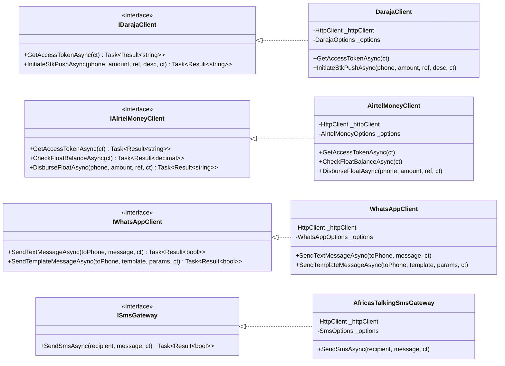
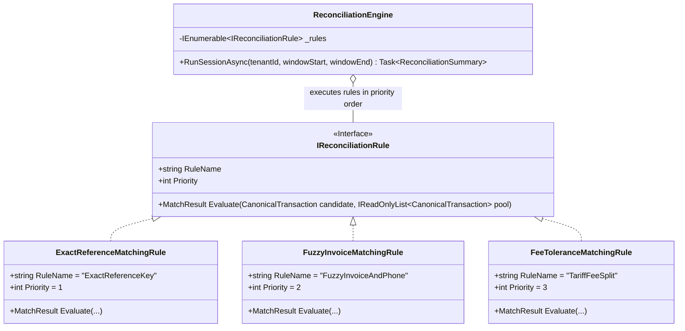

# PesaGraph Domain Model & OOAD Class Diagrams

This document details the Object-Oriented Analysis and Design (OOAD), Domain-Driven Design (DDD) tactical patterns, entity relationships, and aggregate boundaries implemented across PesaGraph.

## 1. Core Domain Aggregate Class Diagram

```mermaid
classDiagram
    direction TB

    class Entity~TId~ {
        <<Abstract>>
        +TId Id
        +bool Equals(object obj)
        +int GetHashCode()
    }

    class AggregateRoot~TId~ {
        <<Abstract>>
        -List~IDomainEvent~ _domainEvents
        +IReadOnlyCollection~IDomainEvent~ DomainEvents
        +void AddDomainEvent(IDomainEvent domainEvent)
        +void ClearDomainEvents()
    }

    class ValueObject {
        <<Abstract>>
        #IEnumerable~object~ GetEqualityComponents()*
        +bool Equals(object obj)
    }

    Entity~TId~ <|-- AggregateRoot~TId~

    class Money {
        +decimal Amount
        +Currency Currency
        +Money Add(Money other)
        +Money Subtract(Money other)
        +Money Multiply(decimal multiplier)
    }
    ValueObject <|-- Money

    class Currency {
        +string Code
        +string Symbol
        +static Currency KES
        +static Currency USD
    }
    ValueObject <|-- Currency
    Money *-- Currency

    class Tenant {
        +Guid Id
        +string Name
        +string Slug
        +TenantStatus Status
        +DateTime CreatedAtUtc
        +ICollection~ApiKey~ ApiKeys
        +void Deactivate()
        +ApiKey GenerateApiKey(string description)
    }
    AggregateRoot~Guid~ <|-- Tenant

    class ApiKey {
        +Guid Id
        +Guid TenantId
        +string KeyHash
        +string KeyPrefix
        +string Description
        +bool IsRevoked
        +DateTime? ExpiresAtUtc
        +void Revoke()
    }
    Entity~Guid~ <|-- ApiKey
    Tenant "1" *-- "many" ApiKey : owns

    class CanonicalTransaction {
        +Guid Id
        +Guid TenantId
        +string Provider
        +string Channel
        +string ProviderReference
        +string ExternalReference
        +Money Amount
        +TransactionType Type
        +TransactionStatus Status
        +string SourceAccount
        +string DestinationAccount
        +DateTime OccurredAtUtc
        +Dictionary~string, object~ Metadata
        +void MarkAsReconciled()
        +void MarkAsDisputed(string reason)
    }
    AggregateRoot~Guid~ <|-- CanonicalTransaction
    CanonicalTransaction *-- Money

    class Account {
        +Guid Id
        +Guid TenantId
        +string AccountNumber
        +string Name
        +AccountType Type
        +Currency Currency
        +decimal CurrentBalance
        +bool IsActive
        +void ApplyEntry(decimal deltaAmount, bool isDebit)
    }
    AggregateRoot~Guid~ <|-- Account

    class JournalEntry {
        +Guid Id
        +Guid TenantId
        +string ReferenceNumber
        +DateTime PostedAtUtc
        +string Description
        +ICollection~Posting~ Postings
        +void AddPosting(Guid accountId, decimal debit, decimal credit)
        +bool ValidateDoubleEntryBalance()
    }
    AggregateRoot~Guid~ <|-- JournalEntry

    class Posting {
        +Guid Id
        +Guid JournalEntryId
        +Guid AccountId
        +decimal Debit
        +decimal Credit
    }
    Entity~Guid~ <|-- Posting
    JournalEntry "1" *-- "2..*" Posting : contains

    class ReconciliationSession {
        +Guid Id
        +Guid TenantId
        +ReconciliationStatus Status
        +DateTime StartedAtUtc
        +DateTime? CompletedAtUtc
        +int TotalProcessed
        +int MatchedCount
        +int UnmatchedCount
        +int DiscrepancyCount
        +ICollection~MatchedPair~ MatchedPairs
        +ICollection~DiscrepancyItem~ Discrepancies
        +void Complete()
    }
    AggregateRoot~Guid~ <|-- ReconciliationSession

    class MatchedPair {
        +Guid Id
        +Guid SessionId
        +Guid LeftTransactionId
        +Guid RightTransactionId
        +string RuleApplied
        +decimal ConfidenceScore
        +DateTime MatchedAtUtc
    }
    Entity~Guid~ <|-- MatchedPair
    ReconciliationSession "1" *-- "many" MatchedPair : records

    class DiscrepancyItem {
        +Guid Id
        +Guid SessionId
        +Guid TransactionId
        +string Reason
        +decimal VarianceAmount
        +DiscrepancyStatus Status
        +void Resolve(string resolutionNotes)
    }
    Entity~Guid~ <|-- DiscrepancyItem
    ReconciliationSession "1" *-- "many" DiscrepancyItem : records

    class AuditLogEntry {
        +Guid Id
        +Guid TenantId
        +string Action
        +string EntityName
        +string EntityId
        +string PerformedBy
        +string OldValuesJson
        +string NewValuesJson
        +string CurrentHash
        +string PreviousHash
        +DateTime TimestampUtc
        +bool VerifyIntegrity(string calculatedPreviousHash)
    }
    Entity~Guid~ <|-- AuditLogEntry
```

---

## 2. Provider Adapter Inheritance & Strategy Hierarchy

---

## 3. Reconciliation Rule Engine Strategy Pattern

