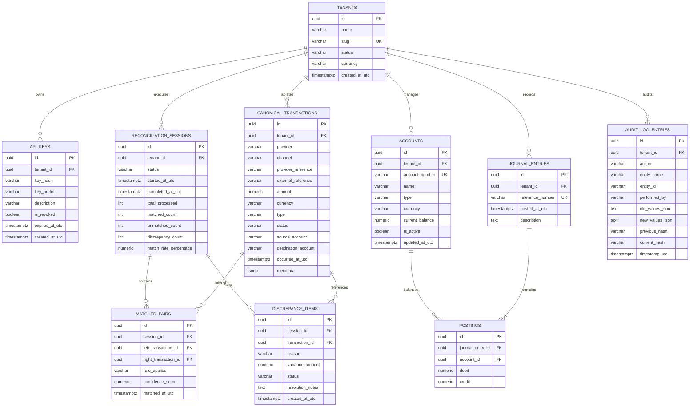

# PesaGraph Relational Data Model (Entity-Relationship Diagram)

This document maps out the relational database schema implemented with Entity Framework Core (PostgreSQL) in `PesaGraph.Infrastructure.Persistence.ApplicationDbContext`.

## Entity-Relationship Diagram (ERD)

