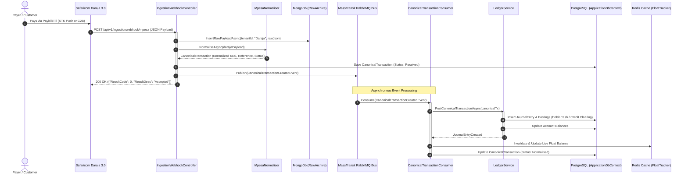
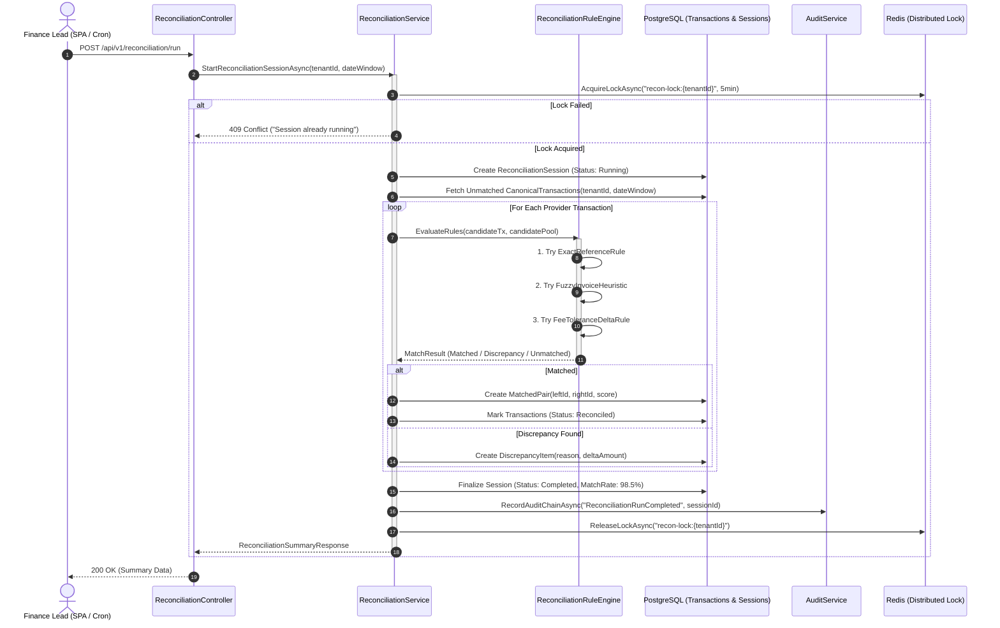
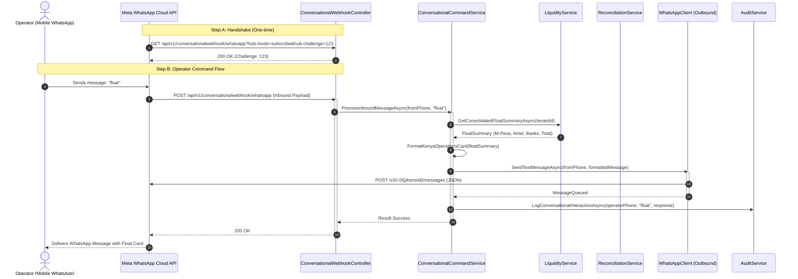
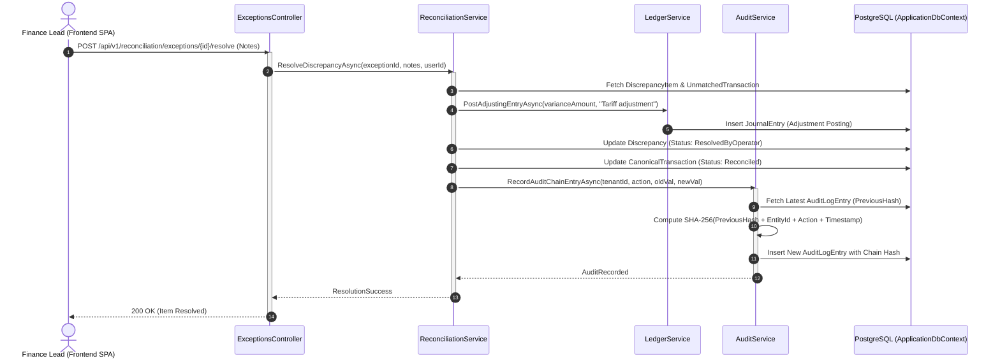

# PesaGraph End-to-End Sequence Diagrams

This document illustrates the interactions, message passes, and lifecycle lifelines for the four critical workflows in PesaGraph.

## 1. Webhook Ingestion & Canonical Normalisation Sequence

---

## 2. Cross-Rail Automated Reconciliation Run Sequence

---

## 3. WhatsApp Conversational Interface Execution Sequence

---

## 4. Discrepancy Resolution & Audit Hash Chaining Sequence

