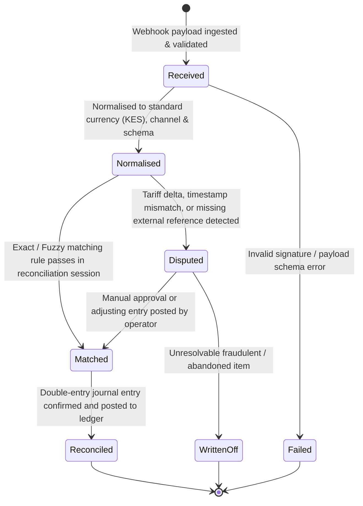
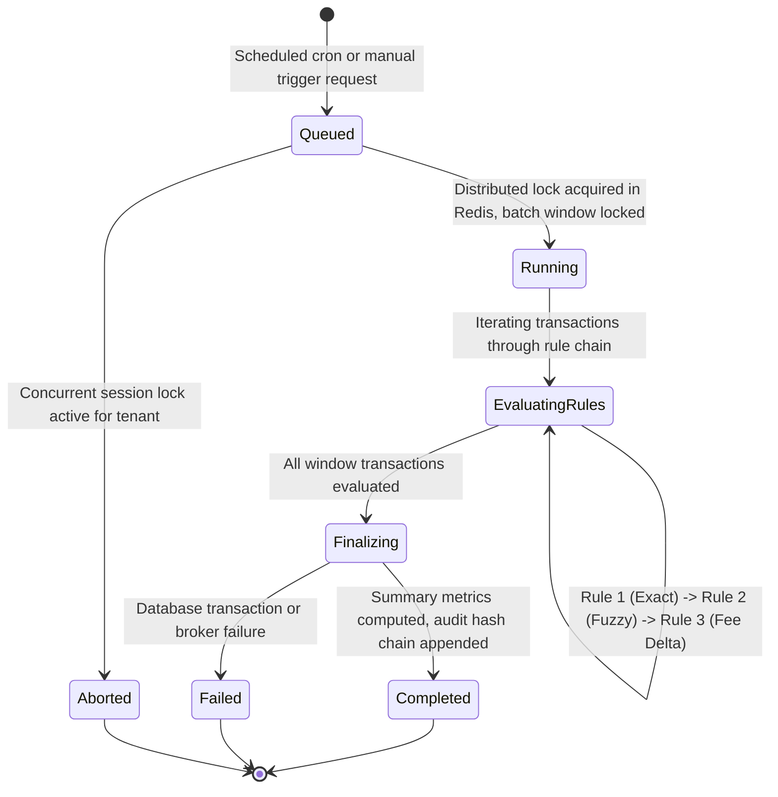
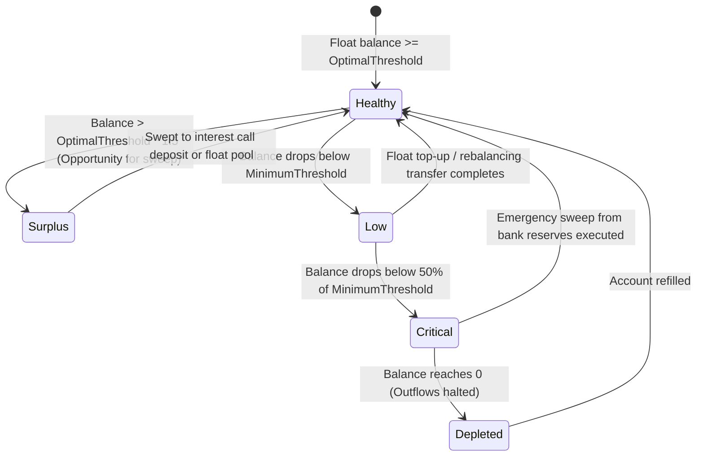
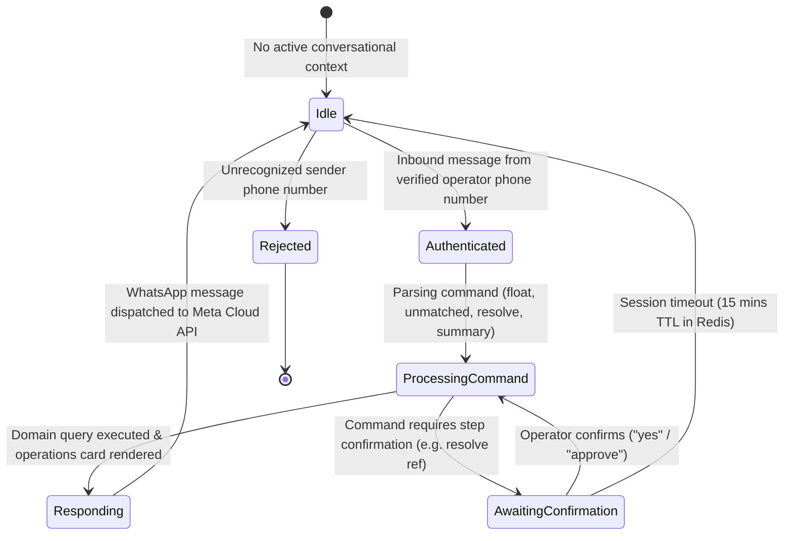

# PesaGraph State Machine & Entity Lifecycle Diagrams

This document contains state transition diagrams mapping the lifecycle of transactions, reconciliation sessions, float alert states, and conversational sessions.

## 1. Canonical Transaction Lifecycle State Machine

---

## 2. Reconciliation Session State Machine

---

## 3. Float & Liquidity Position Health State Machine

---

## 4. WhatsApp Conversational Session State Machine

