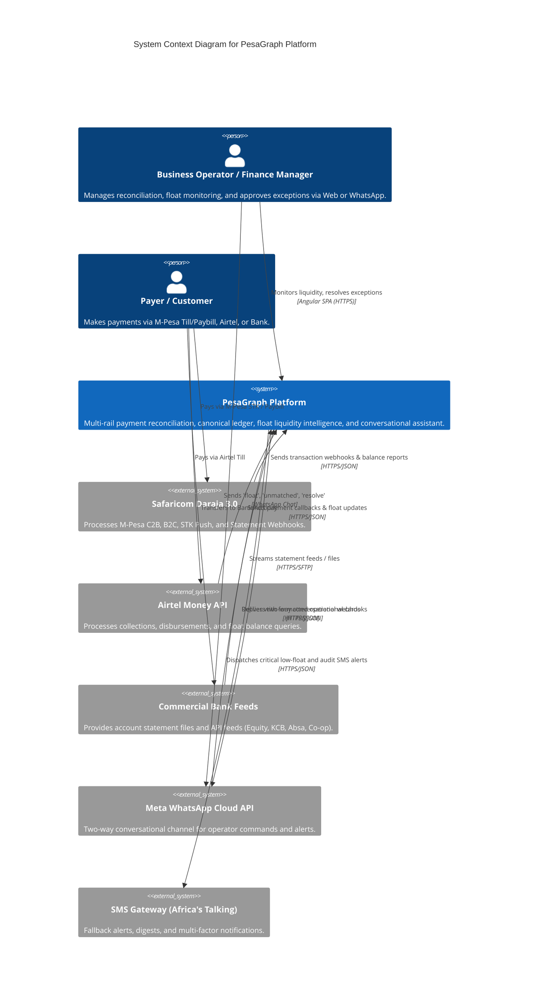
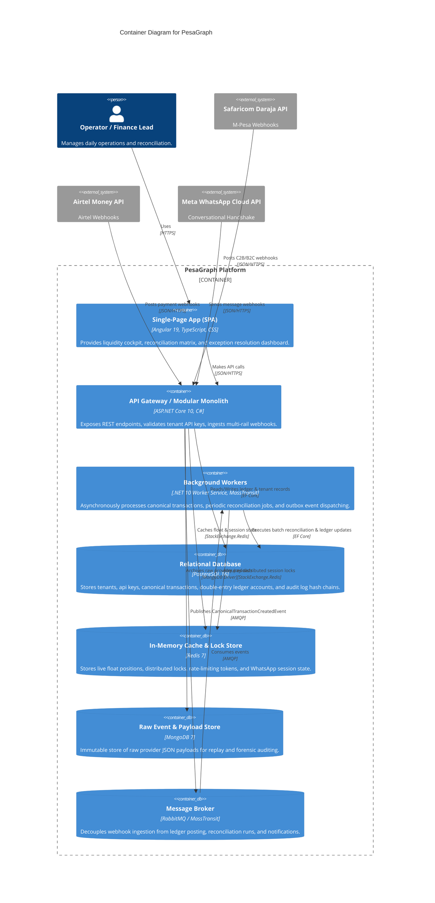
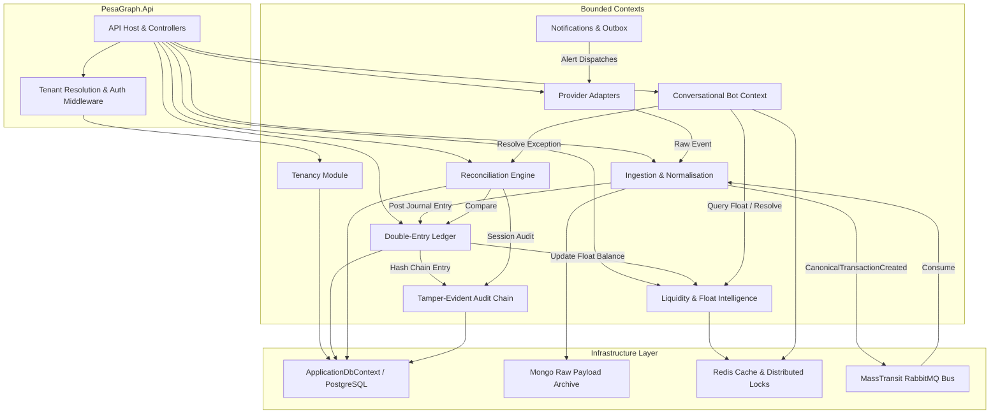

# PesaGraph Architecture & System Context (C4 Context & Container)

This document maps out the system context, containers, and external payment and messaging rails that PesaGraph interacts with.

## 1. System Context Diagram (C4 Level 1)

---

## 2. Container Diagram (C4 Level 2)

---

## 3. Modular Monolith Component Architecture (C4 Level 3)

